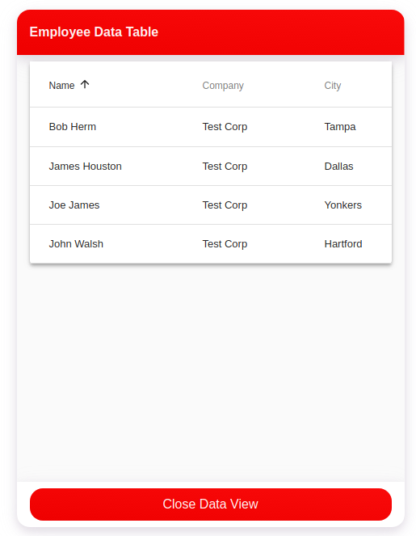
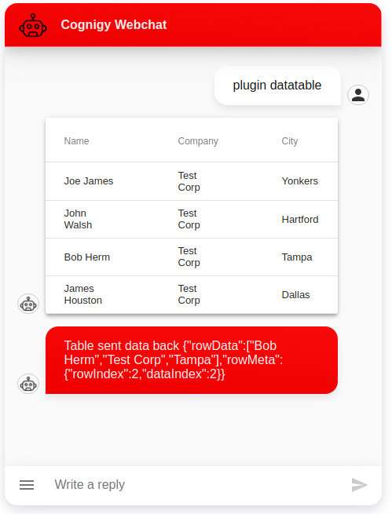

# Cognigy Webchat Datatable Plugin
This repository contains a datatable plugin for the [Cognigy Webchat](https://github.com/Cognigy/WebchatWidget).
It wraps the [MUI Datatables](https://github.com/gregnb/mui-datatables) component for use in the Cognigy Webchat.




## Installation

1. Clone this repo
2. Install all necessary dependencies via `nmp i`
3. Run `npm run build` - this will create a `dist/datatable.webchat-plugin.js` plugin file for you
4. Use that file in your Cognigy Webchat as described in the [Cognigy Docs](https://docs.cognigy.com/docs/using-additional-webchat-plugins).

## Calling the Plugin from Cognigy
You can call the plugin from within Cognigy by sending a data message using a Say Node.

```JSON
{
  "_plugin": {
    "type": "datatable",
    "title": "",
    "displayMode": "inline", 
    "buttonText": "Open Employee Data",
    "headerText": "Employee Data Table",
    "subtitleText": "",
    "cancelButtonText": "Close Data View",
    "tabledata": {
      "columns": ["Name", "Company", "City"],
        "data": [
          ["Joe James", "Test Corp", "Yonkers"],
          ["John Walsh", "Test Corp", "Hartford"],
          ["Bob Herm", "Test Corp", "Tampa"],
          ["James Houston", "Test Corp", "Dallas"],
        ],
        "options": {
          "rowClickPostback": true
        }
    }
  }
}
```

For the `options` object, you can see all available options here: [MUI Datatables Options](https://github.com/gregnb/mui-datatables#options). 

### Fullscreen vs Inline

You can display a table inline in the chat or fullscreen in the webchat widget. To decide which, add the following parameter (`_plugin.displaymode`):

- `inline` - displays the table inside the chat itself [default]
- `toggle` - displays the table inside the chat with a button to toggle fullscreen

### Option to trigger Postback on selecting Rows

You can send a data message back to Cognigy.AI when a row is selected. You can do that by adding the following option to `_plugin.tabledata.options`:

`rowSelectPostback: true`

### Option to trigger Postback on selecting Rows

You can send a data message back to Cognigy.AI when a cell is selected. You can do that by adding the following option to `_plugin.tabledata.options`:

`cellSelectPostback: true`


### Options Defauls

We have overridden several options:

| Option | Original Default | Cognigy Default |
| ------ | ---------------- | --------------- |
| selectableRows | true | false |
| selectableRowsOnClick | true | false |
| pagination | true | false |
| download | true | false |
| print | true | false |
| filter | true | false |
| search | true | false |
| viewColumns | true | false |

